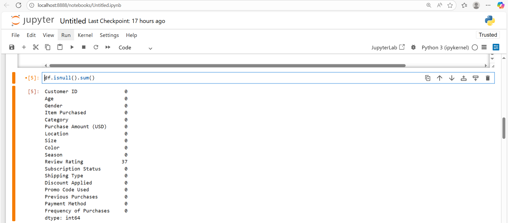
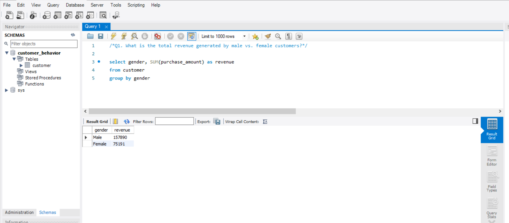
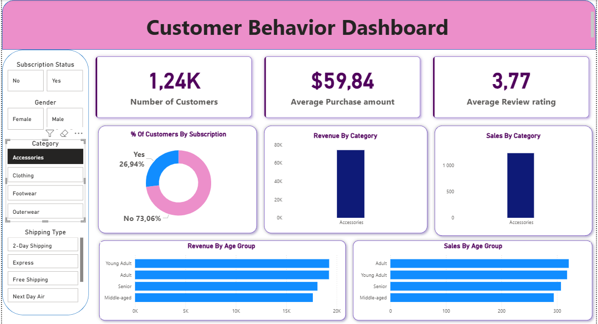
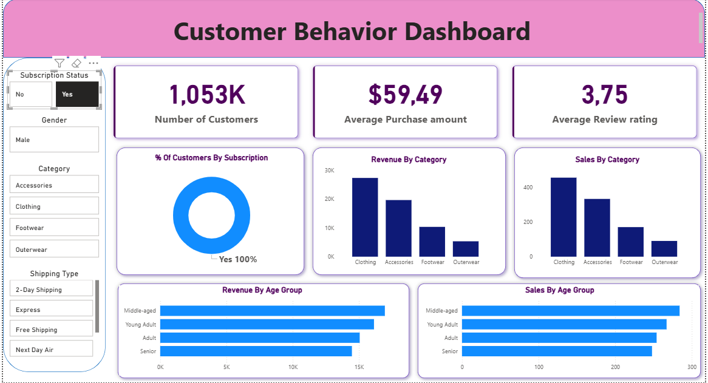

# 📊 Customer Behavior Analysis Project

## 📌 Project Overview
This project analyzes customer shopping behavior to uncover purchasing patterns, revenue drivers, and customer segments.  
It demonstrates an **end-to-end data analytics workflow** using **Python, SQL, and Power BI**, transforming raw data into actionable business insights.

The project is designed to reflect **real-world analytics tasks** typically performed by junior data analysts.

---

## 🛠 Tools & Technologies
- **Python**: Pandas, SQLAlchemy, PyMySQL  
- **SQL**: MySQL  
- **Power BI**: Interactive dashboards & KPIs  

---

## 🔄 Project Workflow

**Data Source → Python Cleaning → MySQL Analysis → Power BI Visualization**

---

## 🐍 Python – Data Cleaning & Preparation
Python was used to clean, transform, and prepare the dataset for analysis.

Key steps included:
- Loading and exploring the dataset
- Handling missing values using median imputation
- Standardizing column names
- Creating age group segments using quantile binning
- Removing redundant columns
- Uploading cleaned data into MySQL using SQLAlchemy

📁 Code location: `python/customer_shopping_behavior.ipynb`

---

## 🗄 SQL – Business Analysis
SQL queries were written to answer real business questions such as:

- What is the revenue split by gender?
- Do subscribed customers spend more than non-subscribers?
- Which products receive the highest customer ratings?
- How do discounts affect purchasing behavior?
- How are customers segmented (New, Returning, Loyal)?
- Which age groups contribute the most revenue?

📁 Queries available in: `sql/customer_shopping_behavior.sql`

---

## 📈 Power BI – Interactive Dashboard
An interactive Power BI dashboard was developed to visualize key metrics and trends, including:

- Total customers, average purchase amount, and average review rating
- Revenue and sales by product category
- Subscription status distribution
- Revenue and sales by age group
- Dynamic filtering by gender, category, subscription status, and shipping type

### Key Dashboard Insights

**Revenue by Category**

**Subscription Analysis**

📁 Dashboard screenshots available in: `power_bi`

---

## 🔍 Key Insights
- Clothing generates the highest revenue and sales volume
- Subscribed customers show higher average spending
- Young adults contribute the largest share of total revenue
- Discounts significantly influence purchasing behavior for selected products
- Loyal customers represent a smaller group but contribute disproportionately to revenue

---

## 🚀 Outcome
This project demonstrates:
- Strong data cleaning and preprocessing skills
- Practical SQL analysis aligned with business questions
- Ability to design clear, interactive Power BI dashboards
- End-to-end analytics thinking from raw data to insights

It is suitable for showcasing **job-ready data analytics skills** in a portfolio or technical interview.

---

## 📬 Contact
**Tshedza Tshipuke**  
Aspiring Data Analyst  

- GitHub: https://github.com/your-username  
- LinkedIn: https://linkedin.com/in/your-profile

